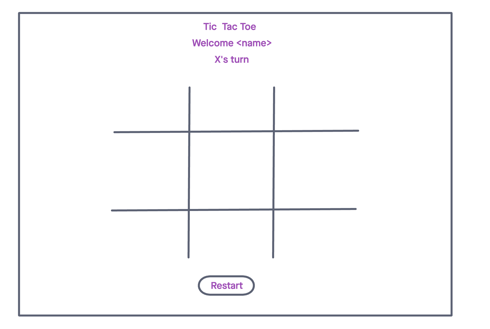

# Tic Tac Toe

A simple browser game built using HTML, CSS, and JavaScript.

# User Stories

- As a user, I want to play a game of Tic Tac Toe with a friend.

- As a user, I should be able to click on an open space on the gameboard and have my player icon (X or O) occupy that space.

- As a user, I should be alerted that I've won, if I have a  winning combo.

- As a user, the game should restart if there is a tie.

- As a user, I want to be able to add my name and see it displayed on the DOM.

- As a user, I should know when it's my turn. 

- As a user, I want to see the score from previous matches.

- As a user, I should be able to restart a game at any point.

# Technologies Used

- HTML5
- CSS3
- Javascript
- Bootstrap

# Screenshots

# Getting Started

[Click here](www.google.com) to play tic tac toe!

# Future Enhancements

- Add ability for users to see the results of previous matches.
- Allow user(s) to add their name to be used in the game play.